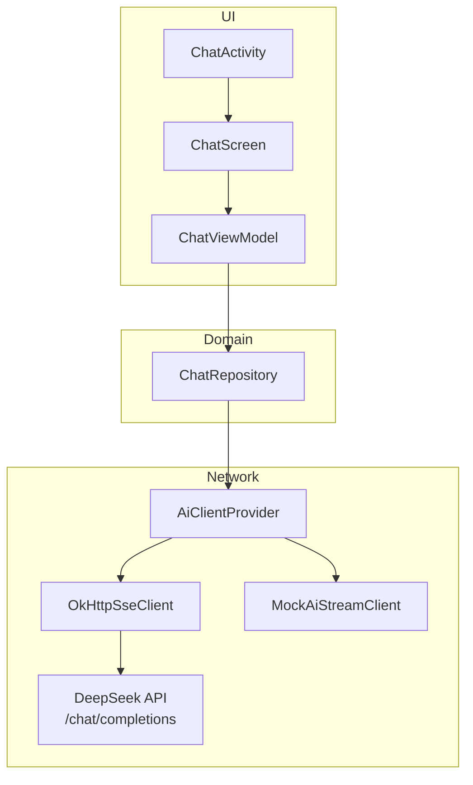

# DeepSeek Chat Demo

一款参考 DeepSeek Android 客户端风格的 AI 聊天 Demo。应用通过 DeepSeek 开放 API 获取真实流式回复，支持深度思考过程展示、Markdown 渲染，并提供接近官方客户端的聊天界面。

## 功能特性

- **DeepSeek API 对接**：OpenAI 兼容的 SSE 流式对话，支持 `deepseek-chat` / `deepseek-v4-flash` 等模型
- **深度思考展示**：分别流式渲染 `reasoning_content`（思考过程）与 `content`（正式回答），思考卡片可折叠
- **Markdown 渲染**：Assistant 回复支持标题、列表、代码块等（Markwon）；解析在后台线程执行，减轻主线程压力
- **DeepSeek 风格 UI**：Jetpack Compose 实现，含顶栏、空状态推荐问题、用户气泡、输入栏与圆形发送/停止按钮
- **随机快捷问题**：首页从 12 条问题池中随机展示 4 条，每次进入空状态或新建对话时刷新
- **智能列表滚动**：默认贴底跟随新内容；用户上滑查看历史时不抢滚动，滑回底部后恢复自动跟随
- **API Key 可配置**：支持 `local.properties`、Gradle 属性、环境变量
- **无 Key 降级**：未配置 API Key 时使用 Mock 客户端，便于 UI 调试

## 技术栈

| 类别 | 选型 |
|------|------|
| 语言 | Kotlin 2.3 |
| 最低 SDK | 24 |
| UI | Jetpack Compose + Material 3 |
| 架构 | MVVM + 单向数据流（StateFlow） |
| 网络 | OkHttp 5 + SSE |
| Markdown | Markwon 4.6 |
| 异步 | Kotlin Coroutines + Flow |
| 测试 | JUnit 4 + kotlinx-coroutines-test |

## 项目结构

```
app/src/main/java/com/example/aichatdemo/
├── ui/chat/
│   ├── ChatActivity.kt          # 入口 Activity，挂载 Compose 界面
│   ├── ChatScreen.kt            # 聊天主界面（顶栏、消息列表、输入栏、空状态）
│   ├── ChatViewModel.kt         # 消息状态、流式节流、发送/停止/清空
│   ├── ChatUiState.kt           # UI 状态
│   ├── ChatUiEvent.kt           # 侧效事件（当前 UI 主要订阅 StateFlow）
│   ├── component/
│   │   └── MarkdownText.kt      # AndroidView + Markwon，后台 parse/render
│   └── theme/
│       └── DeepSeekTheme.kt     # 品牌色与 Material 主题
├── data/
│   ├── ChatRepository.kt        # 仓库层，委托 AiStreamClient
│   └── model/
│       ├── ChatMessage.kt       # 消息模型（含 reasoningContent）
│       └── Role.kt
└── network/
    ├── AiClientProvider.kt      # 根据 BuildConfig 选择真实/Mock 客户端
    ├── OkHttpSseClient.kt       # SSE 请求与流式读取
    ├── DeepSeekStreamParser.kt  # 解析 reasoning_content / content
    ├── DeepSeekApiError.kt      # HTTP 错误友好化（401/402 等）
    ├── MockAiStreamClient.kt    # 本地模拟流式回复
    ├── AiStreamClient.kt
    └── ChatStreamEvent.kt       # ReasoningToken / ContentToken / Done
```

## 架构说明

应用采用分层 MVVM，数据自网络层向上流经 ViewModel，最终以 `ChatUiState` 驱动 Compose UI。



### 数据流（发送一条消息）

1. 用户在 `ChatInputBar` 输入并发送
2. `ChatViewModel.sendMessage()` 追加 user 消息与 assistant 占位消息
3. `ChatRepository.sendMessageStream()` 调用 `AiStreamClient.stream()`
4. `OkHttpSseClient` 建立 SSE 连接，逐行读取 `data:` 事件
5. `DeepSeekStreamParser` 解析 delta，区分 `ReasoningToken` 与 `ContentToken`
6. ViewModel 将 token 写入缓冲区，**每 75ms 节流** 合并后更新 `uiState`
7. `ChatScreen` 订阅 `uiState`，LazyColumn 重绘最后一条消息；`MarkdownText` 在后台线程 parse Markdown

### 关键实现细节

**SSE 与思考模式**

DeepSeek 思考模式下，流式 chunk 中 `reasoning_content` 与 `content` 互斥出现。解析时需跳过 JSON `null`，避免将字面量 `"null"` 拼入正文。

**Markdown 流式渲染**

- 流式过程中持续渲染 Markdown（非纯文本降级）
- `MarkdownText` 使用 `LaunchedEffect` + `Dispatchers.Default` 执行 `parse → render`
- 新内容到达时取消上一次未完成的解析，只应用最新结果

**列表滚动策略**

- `stickToBottom = true` 时，内容更新调用 `scrollToItem` 贴底
- 用户上滑时关闭自动滚动，滑回底部后恢复
- 避免 `animateScrollToItem` 与用户手势冲突

**键盘与边到边**

- `enableEdgeToEdge()` + `statusBarsPadding()` 防止顶栏被状态栏遮挡
- 输入栏使用 `imePadding()` + `navigationBarsPadding()`
- `windowSoftInputMode="adjustNothing"`，由 Compose 自行处理 insets

## 配置 DeepSeek API

在项目根目录 `local.properties` 中添加（该文件不应提交到 Git）：

```properties
deepseek.api.key=sk-你的密钥

# 可选
deepseek.base.url=https://api.deepseek.com
deepseek.model=deepseek-chat
```

也支持以下方式（优先级：Gradle 属性 > 环境变量 > local.properties）：

| 配置项 | Gradle 属性 | local.properties | 环境变量 | 默认值 |
|--------|-------------|------------------|----------|--------|
| API Key | `DEEPSEEK_API_KEY` | `deepseek.api.key` | `DEEPSEEK_API_KEY` | （空，使用 Mock） |
| Base URL | `DEEPSEEK_BASE_URL` | `deepseek.base.url` | `DEEPSEEK_BASE_URL` | `https://api.deepseek.com` |
| Model | `DEEPSEEK_MODEL` | `deepseek.model` | `DEEPSEEK_MODEL` | `deepseek-chat` |

修改配置后需**重新编译**安装，BuildConfig 才会更新。

### CI Release 构建（GitHub Actions）

本地 `local.properties` 不会上传到 GitHub。Release 包所需密钥由 **`signing/ci-build-secrets.manifest`** 声明，通过 GitHub Secret 在 CI 注入 `BuildConfig`：

```bash
# 从 local.properties 读取并写入 GitHub Secret
~/tools/scripts/setup-app-build-secrets.sh --project-dir ~/work/AiChatHub
```

通用接入说明见 `~/tools/scripts/app-build-secrets.README`。

> **安全提示**：Release APK 会内置 API Key（与本地 debug 包相同）。仅适合个人或小范围分发；勿将 APK 公开传播。若需多人使用且保护密钥，应改为自建后端代理。

> **注意**：HTTP 402 表示账户余额不足，需在 [DeepSeek 开放平台](https://platform.deepseek.com) 充值。

## 构建与运行

### 环境要求

- Android Studio（推荐）或 JDK 17+
- Android SDK（`compileSdk 36`，`minSdk 24`）
- 真机或模拟器（需联网）

### 命令行编译

```bash
# 编译 Debug 包
./gradlew :app:assembleDebug

# 安装到已连接设备
./gradlew :app:installDebug

# 运行单元测试
./gradlew :app:testDebugUnitTest
```

### 一键安装脚本

项目根目录提供了 `install.sh`，会自动编译、安装并启动应用：

```bash
./install.sh
```

脚本会检查 `adb` 与设备连接；多设备时默认使用第一台。

### Android Studio

1. 打开项目根目录
2. 配置好 `local.properties` 中的 `sdk.dir` 与 `deepseek.api.key`
3. 选择 `app` 运行配置，Run 到设备

启动后进入 `ChatActivity`（Launcher Activity）。

## 测试

单元测试位于 `app/src/test/`，覆盖：

- `ChatViewModelTest`：流式消息状态、思考与回答分离
- `DeepSeekApiErrorTest`：API 错误码友好提示
- `MainScreenViewModelTest`：主屏 ViewModel 基础逻辑

```bash
./gradlew :app:testDebugUnitTest
```

## 界面说明

| 区域 | 说明 |
|------|------|
| 顶栏 | 菜单（占位）、标题、新建对话（清空当前会话） |
| 空状态 | Logo、欢迎语、随机 4 条快捷问题 Chip |
| 用户消息 | 右侧蓝色圆角气泡 |
| Assistant 消息 | 左侧头像 + 思考卡片（可折叠）+ Markdown 正文 |
| 输入栏 | 圆角输入框 + 圆形发送按钮；生成中变为停止按钮 |

## 已知限制

- 侧边栏菜单、历史会话持久化、深色模式尚未实现
- 会话仅在内存中，退出应用或清进程后丢失
- 流式 Markdown 对超长回复仍可能有一定性能开销
- ViewModel 中的 `ChatUiEvent` 仍保留 emit，当前 Compose UI 主要直接订阅 `uiState`

## 相关文档

- [DeepSeek API 文档](https://api-docs.deepseek.com/)
- 项目内 `docs/` 目录含早期需求与架构分析文档

## License

Demo 项目，仅供学习与参考。
